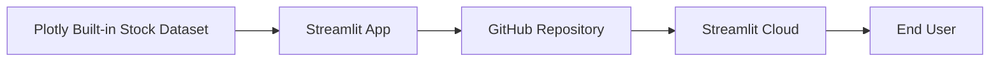

# Stock Explorer

Live App:
https://stock-explorer-6m66ju7qrohm46bgptc8be.streamlit.app/

A simple Streamlit web application for comparing the performance of major technology stocks.

## Features

* Compare multiple technology stocks
* Interactive stock selection
* Growth metrics for each stock
* Best performer indicator
* Interactive Plotly chart
* Public deployment using Streamlit Cloud

## Architecture

## Technologies Used

* Python
* Streamlit
* Plotly
* Pandas
* GitHub
* Streamlit Cloud

## Live Application

https://stock-explorer-6m66ju7qrohm46bgptc8be.streamlit.app/
